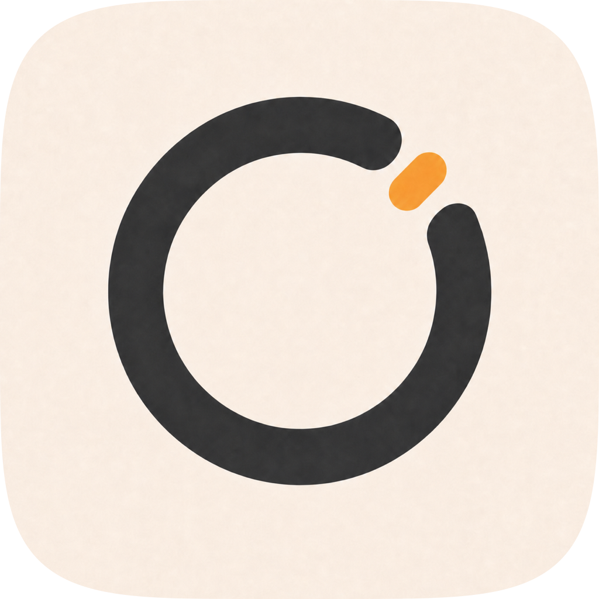

# Relo

Super-minimal menu bar timer for macOS, with natural-language parsing, stopwatch mode, and configurable repeating tones.

## Features

- Menu bar countdown timer and stopwatch with natural-language input.
- Configurable alarm tones, repeat behavior, and volume.
- Popover UI and complete context (right-click) menu.
- Four configurable one-click timer presets.
- Configurable alert behavior and global keyboard shortcuts.

## Requirements

Requires macOS 15 or later.

## Installation

Open `Relo.xcodeproj`, select the `Relo` scheme, and run the app from Xcode. For a private distributable build, follow [RELEASING.md](RELEASING.md) to produce a signed and notarized `Relo.dmg`, then drag `Relo.app` to the Applications folder.

On first launch, macOS may ask whether Relo should launch at login. This can be changed later in Relo Settings or System Settings → General → Login Items & Extensions.

## Releasing

See [RELEASING.md](RELEASING.md) for the full release workflow.

## Credits

- Relo is created and maintained by Nico Estreba.
- Based on [Tock](https://github.com/edelstone/tock) by Michael Edelstone.
- Tones: [Notification Sounds](https://notificationsounds.com)
- Icons: [Tabler Icons](https://tabler.io/icons)
- Typography: [Manrope](https://fonts.google.com/specimen/Manrope)
- Customizable keyboard shortcuts: [KeyboardShortcuts](https://github.com/sindresorhus/KeyboardShortcuts)

## Privacy

Relo does not collect or track personal data. For details, see the [privacy policy](privacy/index.html).

## License

MIT, free for commercial and personal use.
